# dactyl-minidox

## 16 Degrees with 1.5 Thumb (Including Keycaps)

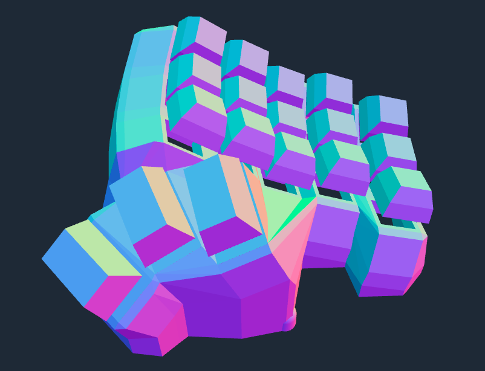

## 16 Degrees with 1u Thumb

## 45 Degrees with 1.5 Thumb

## 45 Degrees with 1.5 Thumb (Including Keycaps)

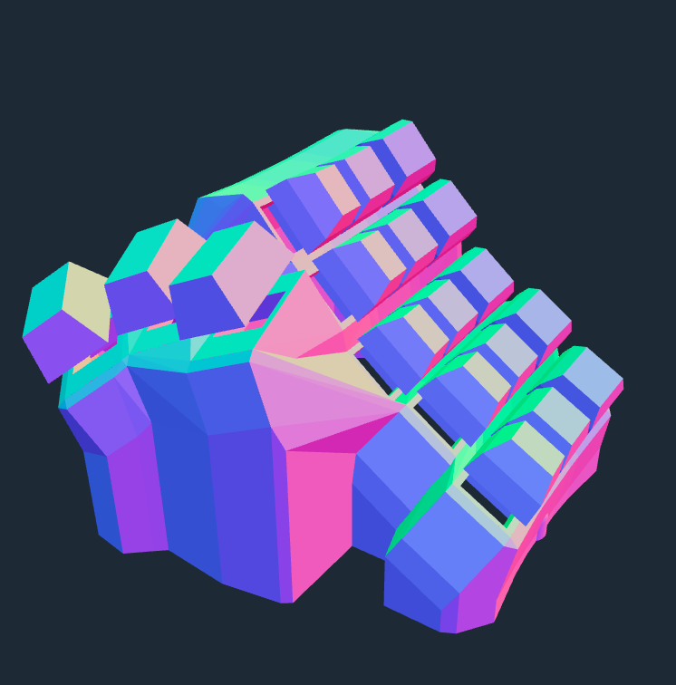

## Single pcb

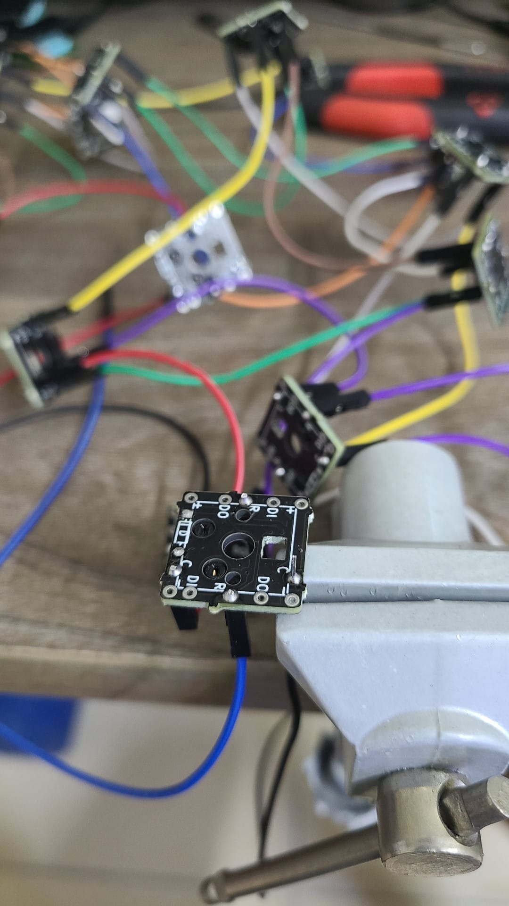

## Completed Handwired - Both Sides

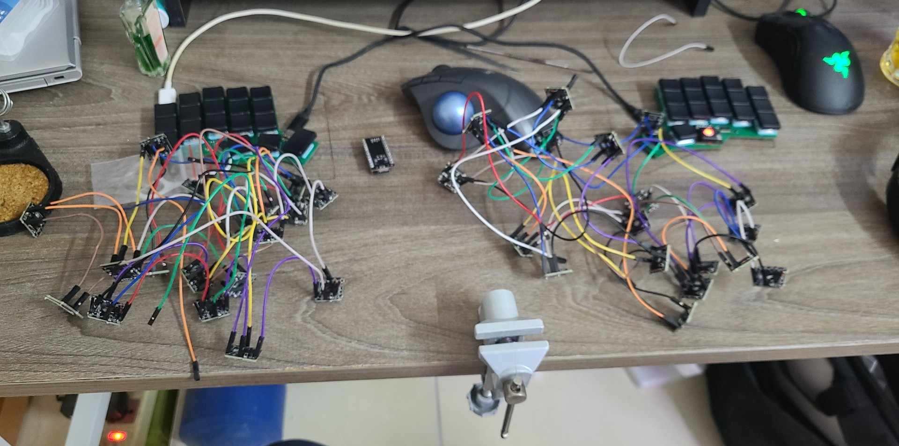

## Completed Handwired - Left Side

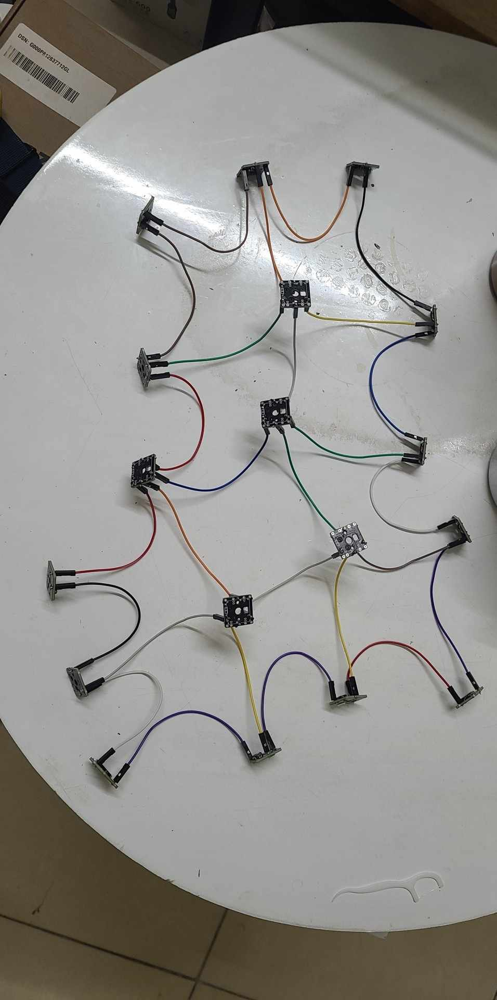

## Controller with Jump

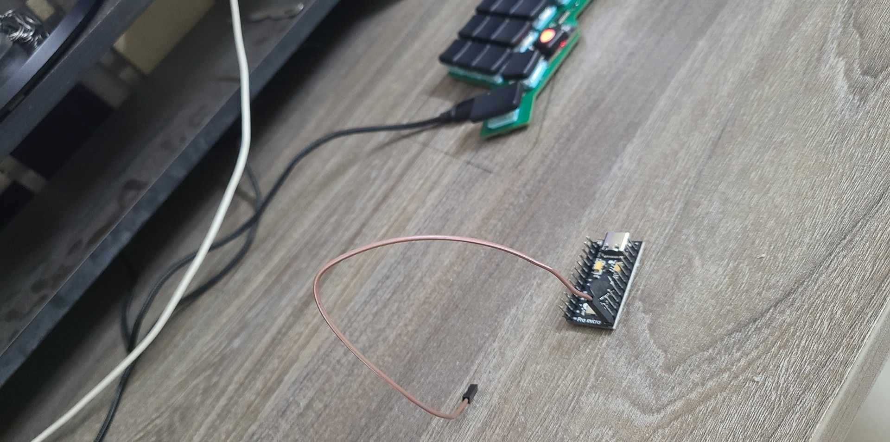

## Failed 3D Print - Minidox

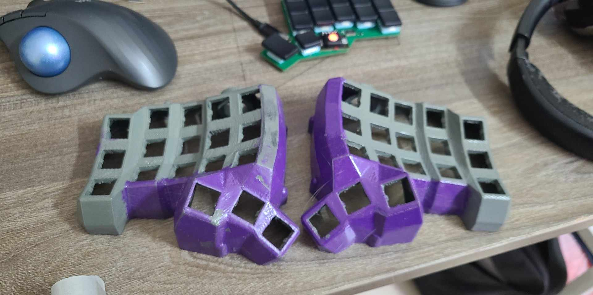

## Single PCB with Male Jump

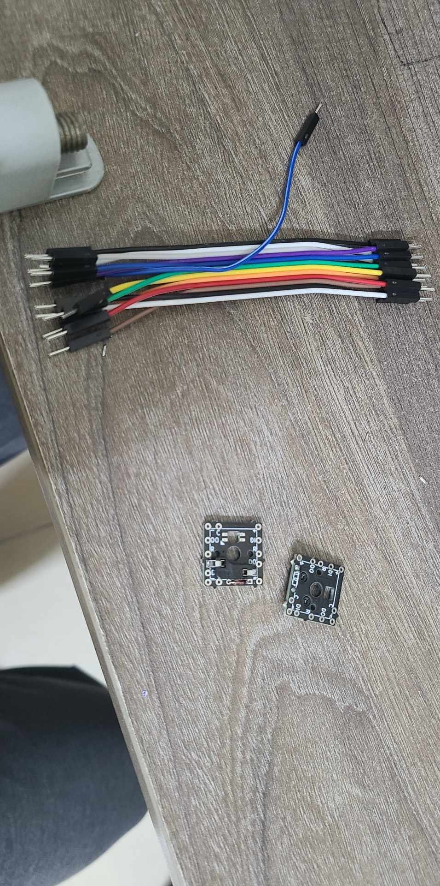

## Testing Single Switch PCB with ProMicro Controller

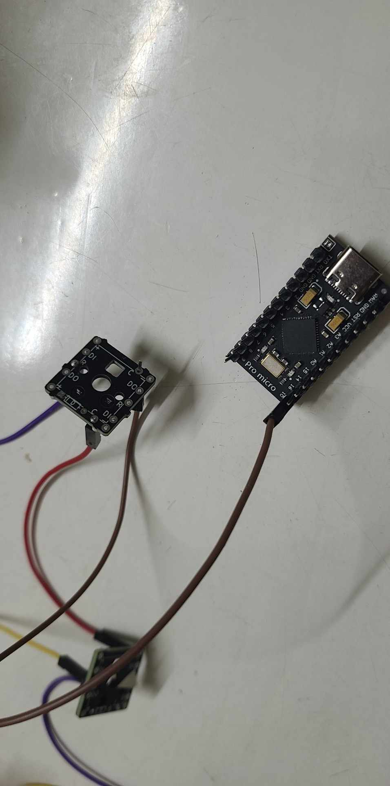

## TRRS Cable

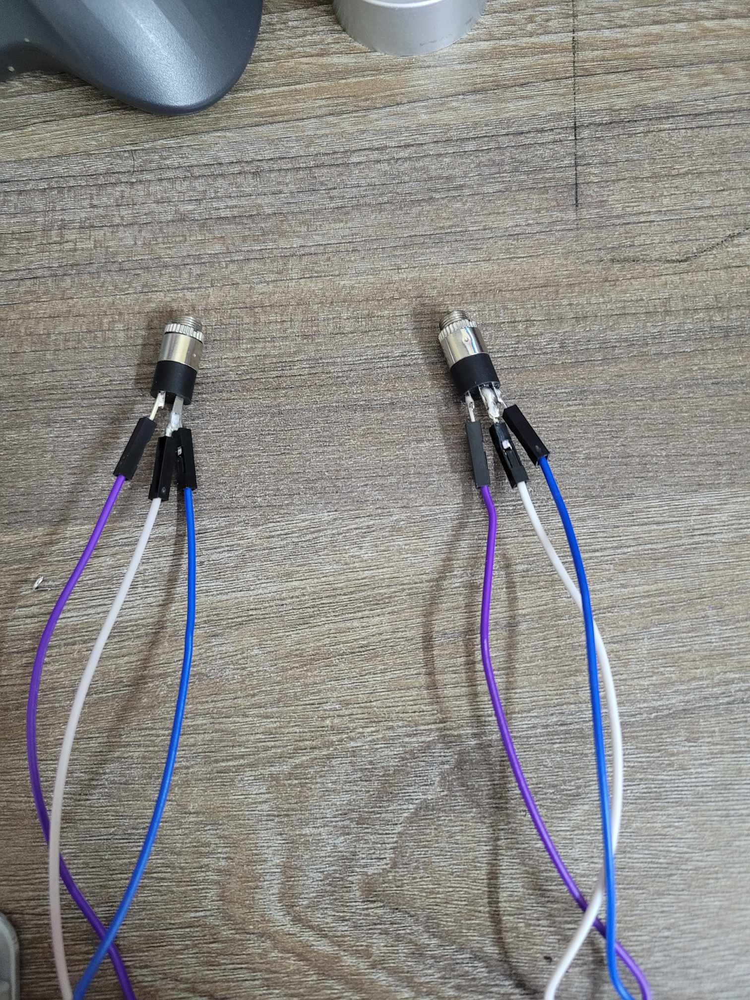

## Welding Quality on the Back of ProMicro Controller

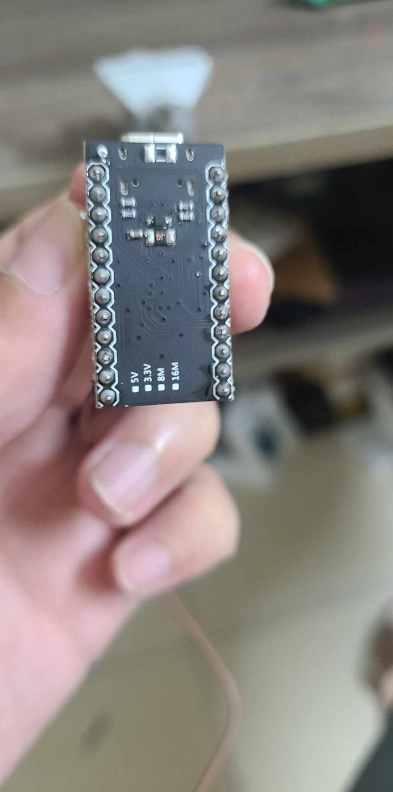

## Housing 3d printed

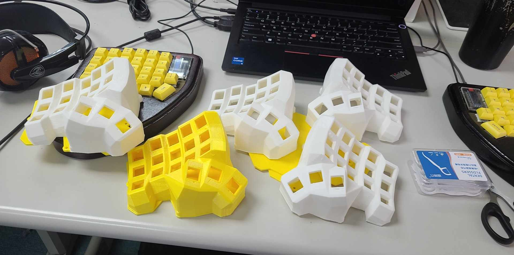

## Housing with keycaps

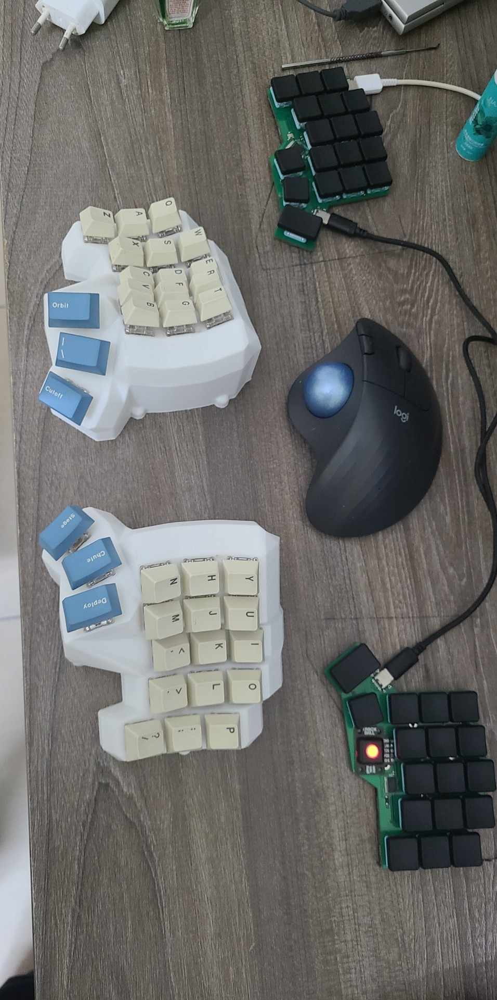
